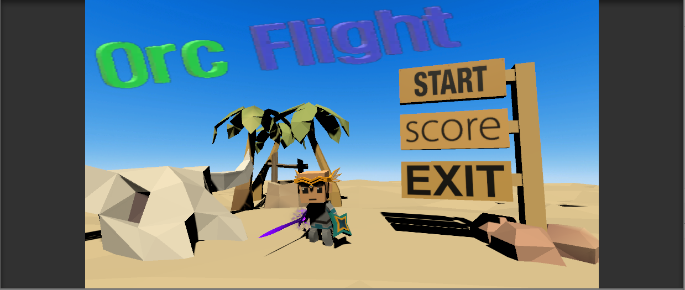

# 게임명 : OrcFlight

---

## 2013182020 박인혁

---

## 게임 장르 : 슈팅

## 카피 게임 : DragonFlight
*
	
	* 카피 게임 이미지. 원작은 2D 게임이지만 3D로 만들 예정.

---
## 게임 개요
* 드래곤 플라이트와 마찬가지로 몰려오는 적들을 죽이며 점수를 흭득하는 것이 목표

* 적들은 죽을 때 일정확률(20%)로 공격력UP, 공격속도UP아이템을 드랍

* 일정점수(500)을 넘어가면 사막맵으로 전환

* 조작법 : ←,→키로 이동 ('a','d' 도 가능), 'z'키로 스킬

* 스킬은 적이 맞을시 빙그르르돌며 잠시 이동을 멈춤, 스킬은 관통

* 공격력UP아이템은 먹을시 공격력 +5, 공격속도UP 아이템은 10%씩 공격속도 향상

---

### 사용된 기술
* 씬 전환시 페이드인,아웃 ( 참조 블로그 : http://blog.naver.com/PostView.nhn?blogId=bestmic&logNo=221335432969&parentCategoryNo=&categoryNo=46&viewDate=&isShowPopularPosts=false&from=postView )
* 생성,소멸자 호출을 줄이기위한 오브젝트 풀
* PlayerPrefe를 통한 하이스코어 저장
* Enemy 클래스 상속을 통한 Enemy01, 02, 03
* 페이드인,아웃을 제외한 모든 스크립트는 자체 제작

---

### 강의 내용 활용
* 3주차와 4주차에 학습한 내용을 토대로 각 오브젝트에 BoxCollider적용 및 라이트, UI를 적용했습니다.
  collider의 경우 OnCollision이벤트가 아닌 OnTrigger 이벤트를 활용하여 충돌처리를 했습니다.
  
* 6주차에 학습한 GetComponent<type>()을 통해 각각의 오브젝트가 자기 자신이 갖고있는 컴포넌트를 불러와서 변수에 저장하였고
  PlayerPrefe를 통해 HighScore 시스템을 만들었습니다.
	
* 7주차에 학습한 코루틴으로 Enemy, Map 등 스폰시스템을 만들었습니다.

* 12주차에 학습한 오브젝트 풀을 통해 Enemy와 map, Bullet(Sword)를 오브젝트 풀로 구현하여 생성자와 소멸자의 호출을 줄였습니다.

* 그 외 ProTool을 통해 Item 오브젝트를 만들고 빌드를 통해 실행 파일을 만들었고, 각 cs 파일을 만들 때 초기 교수님의 강의를 통한
  다양한 프로그래밍 기법을 활용했습니다.
  
---

### 리소스 출처
* Player Character, Enemy Character : 현장실습 기간 중 유니티 에셋스토어에서 유로로 받은 애셋을 지원해주었었는데, 그 에셋을 사용.
* Player Sword : Unity Asset Store (Hovl studio)
* Stage : Unity Asset Store (GrassRoadRace, Low Poly Desert Pack)
* Effect : Unity Asset Store (JMO Assets - Cartoon FX)

---

### Build폴더에서 .exe 파일로 단독 실행 가능합니다. 
